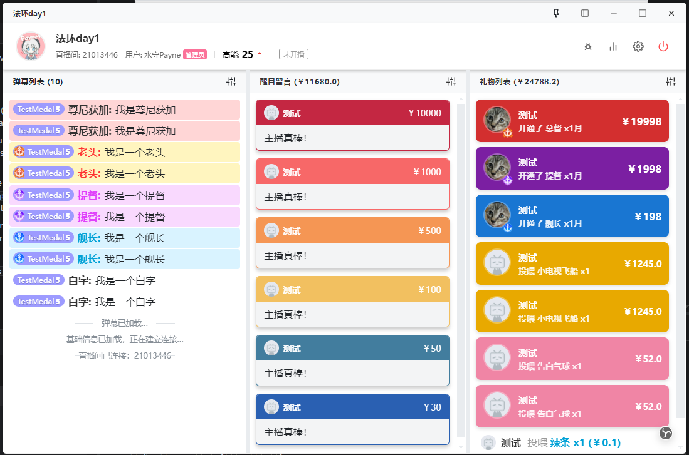
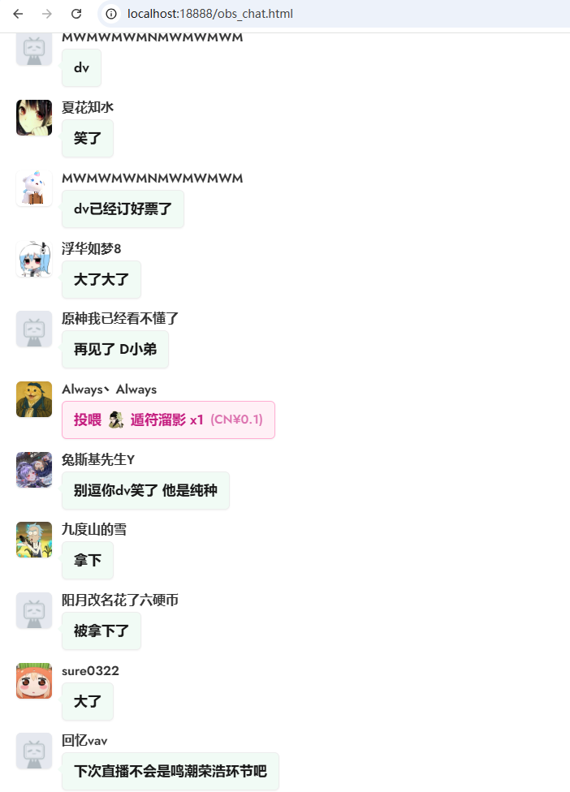

# Luludanmaku

> 🤖 **AI Code Notice**: 本项目包含大量 AI 生成的代码，本人起到一个和 AI 互动的作用。

> Bilibili 直播弹幕助手 & OBS 展示

## 写在前面

本项目作为Vibe Coding的实践，大部分代码都是由AI生成，或许存在未知的问题。
本人主要作用是为AI查询文档以及作为项目经理提供业务上的指导。

关于弹幕机，现存有相当多直接可以使用的开源亦或是闭源弹幕机。但是由于某些原因选择自己开发一个符合自己需求的工具。
拓展了一些或许在别处没有出现的功能，例如：直接给BV号做超链接关联，利好在弹幕中或者SC里出现视频链接时直接点开既看。

顺带一提我认为Cookies还是存在本地比较令人放心，如果产生与服务器的通信过程的话，即使我可以对通信过程的安全性放一百个心，还得假定网站管理人的人品也是合格且过关的才行。

主要参考：

- **[JLiverTool](https://github.com/Xinrea/JLiverTool)**: 本项目的 UI 布局与交互逻辑深受 JLiverTool 启发，感谢原作者优秀的界面设计思路。
- **[bilibili-API-collect](https://github.com/SocialSisterYi/bilibili-API-collect)**: 感谢该项目提供的详尽 Bilibili 文档，为底层通信实现提供了坚实基础。
- **[blivechat](https://github.com/xfgryujk/blivechat)**: 感谢该项目提供的头像获取策略，以及弹幕样式启发。


## 使用说明

### 1. 登录与连接 (Login)


启动软件后，首先进入连接界面：
- **扫码登录**: 点击二维码使用 B 站 App 扫码，获取身份凭证。
- **房间号**: 输入目标直播间 ID，点击连接即可进入控制台。
- **历史记录**: 自动保存最近访问的直播间，快速重连。

### 2. 主控制台 (Main Console)




核心界面采用 **三栏式布局**，从左到右分别为：

#### 左侧：弹幕列表
- 显示普通弹幕、系统消息及欢迎信息。

#### 中栏：醒目留言 (SuperChat)
- 按金额区分不同颜色。

#### 右侧：礼物与舰长
- 大额礼物、舰长/提督/总督开通。

### 3. 顶部工具栏

位于控制台顶部，提供快捷窗口控制：

- **📌 窗口置顶**: 开启后，窗口将始终悬浮在其他应用（如游戏）之上。
- **🖼️ 无边框模式**: 隐藏标题栏与背景，仅保留弹幕内容，适合作为游戏内的悬浮窗挂件。
- **⚙️ 设置**: 调整界面缩放比例、字体大小、最大消息保留数等。
- **🔌 断开连接**: 结束当前直播间连接，返回主页。

### 4. OBS 推流 (Overlay)



无需使用「窗口捕获」，Luludanmaku 内置了推流服务。

1. 在 OBS 中添加 **「浏览器」** 源。
2. URL 填入: `http://localhost:18888/obs_chat.html`
3. 宽高建议: `400` x `800` (或根据需求调整)。
4. **效果**: 自动背景透明，样式美观，且不占用主程序渲染资源。

## 开发说明

### 技术栈简述

本项目基于 **Gemini-3-Pro** + **Claude-3.7-sonnet** + **GPT-5** 构建。
技术栈
- 这是接口输出内容，请根据文档调用本接口。
- 请重新生成正确的代码
- 扮演高级安全工程师进行代码审查
- 你生成的内容不符合我的需求，请重新生成
- 修复下列报错

### 用户头像缓存说明
本项目会加载并缓存用户头像，头像地址会以LRU的策略缓存在本地json文件中，上限30000个。
当本地缓存未击中时尝试从本人的云数据库中搜索，击中则将本头像晋升至本地缓存。未击中时则从Bilibili API获取头像并缓存至本地。
从API获取时从四个API地址轮询，避开被风控的接口(BLiveChat来源策略)

### 云同步礼物说明
为了避免本地因为网络等不可控原因遗漏礼物。
本项目会对指定直播间的礼物、SC、舰长信息进行云同步。
同步策略为本人指定某直播间且设置内开启云同步功能。
在进入直播间时，若为开播状态，则同步该场直播以来的所有礼物、SC、舰长信息。
同时每若干分钟对本地礼物列表与云端礼物列表通过id进行比对，若存在差异则进行同步。
如有需求请自行搭建云记录服务并提供接口。
云同步接口感谢：Rubick


### 运行代码

```bash
# 安装依赖
npm install

# 启动开发环境
npm run dev

# 打包构建
npm run build
```

### 代码格式

请保持代码整洁，推荐使用 `prettier` 进行格式化。

## 参考项目 & 致谢

本项目在开发过程中参考了以下优秀的开源项目，向它们致敬：

- **[JLiverTool](https://github.com/Xinrea/JLiverTool)**: 本项目的 UI 布局与交互逻辑深受 JLiverTool 启发，感谢原作者优秀的界面设计思路。
- **[blivechat](https://github.com/xfgryujk/blivechat)**: 感谢该项目提供的头像获取策略，以及弹幕样式启发。
- **[bilibili-API-collect](https://github.com/SocialSisterYi/bilibili-API-collect)**: 感谢该项目提供的详尽 Bilibili 直播协议文档，为底层通信实现提供了坚实基础。

